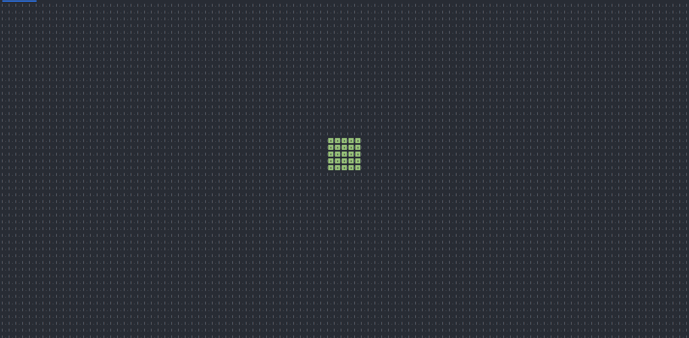
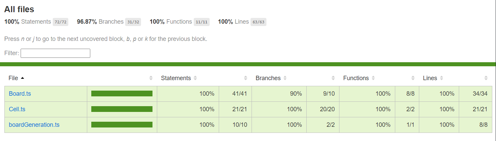
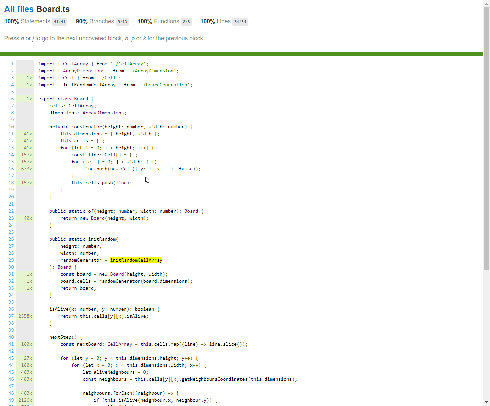
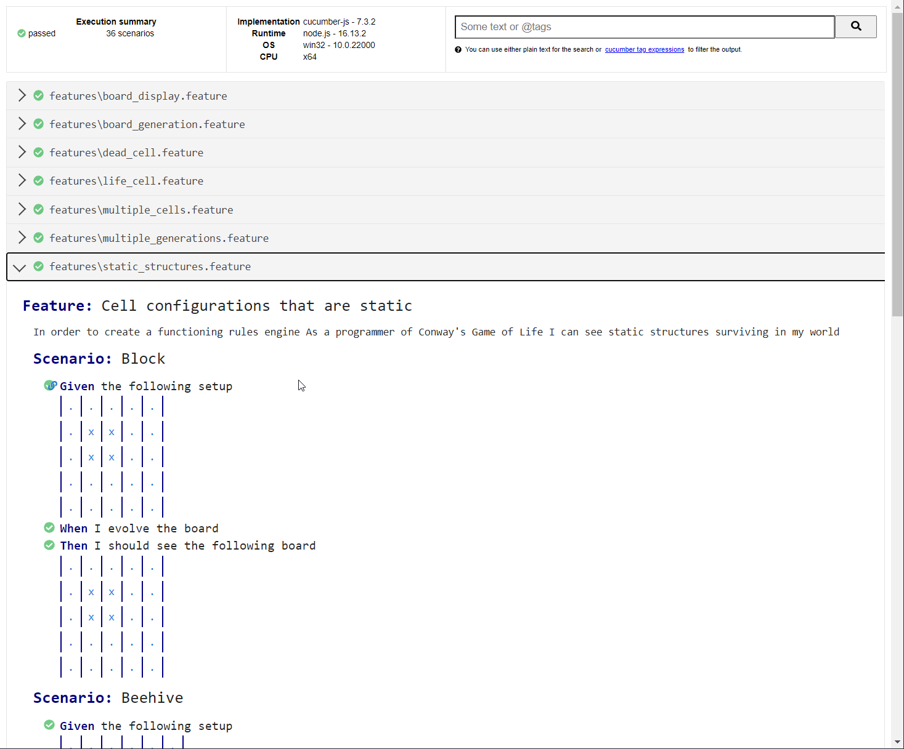
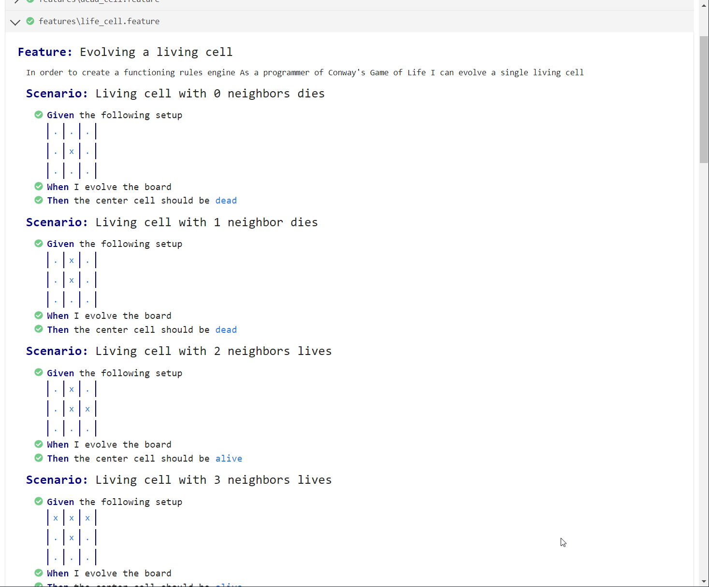

# GameOfLife-BDD



## Rules of life

Based on Wikipedia: Conway's Game of Life: [Rules](http://en.wikipedia.org/wiki/Conway%27s_Game_of_Life#Rules)

The universe of the Game of Life is an infinite two-dimensional orthogonal grid of square *cells*, each of which is in one of two possible states, *alive* or *dead*. Every cell interacts with its eight *neighbors*, which are the cells that are horizontally, vertically, or diagonally adjacent. At each step in time, the following transitions occur:

### 1. Under-Population

- Any live cell with *fewer than 2* live neighbors *dies*

### 2. Next Generation

- Any live cell with *2 or 3* live neighbors *lives* on

### 3. Overcrowding

- Any live cell with *more than 3* live neighbors *dies*

### 4. Reproduction

- Any dead cell with *exactly 3* live neighbors becomes a *live* cell

The first generation is created randomly or with a predefined pattern. 

By applying the above rules simultaneously to every cell in the seed—births and deaths occur simultaneously, and the discrete moment at which this happens is sometimes called a *tick*. The rules continue to be applied repeatedly to create further generations.

## How to run

You can run few commands to start/build this app :

- `npm run start height=30 width=60` : Run compiled app in **dist** folder, *height* and *width* args are optionals.
- `npm run build` : Compile the app and generate **dist** folder
- `npm run build-dev` :  Compile the app and generate **dist** folder then run it ( build + start )
- `npm run dev` : Directly run the TS source project
- `npm run test` : Run cucumber tests. This generate two reports :
  - One in coverage folder which show the test coverage
  - One in **cucumber_report.html** at the root of the project that show how cucumber tests results
- `npm run lint` : Run `Eslint` on source code

## Classes

The two main classes in this App is probably *Board* and *Cell*

### Cell

*Board* class contain a 2D *Cell* array. Each Cell contains two properties :

- *Cell* coordinates
- If *Cell* is alive

The main method compute the neighbors coordinates from it own coordinates :

```typescript
getNeighborsCoordinates(arrayDimensions: ArrayDimensions): Coordinate[] {
    const coordinates: Coordinate[] = [];
    if (this.position.x > 0 && this.position.y > 0) {
        coordinates.push({
            x: this.position.x - 1,
            y: this.position.y - 1,
        });
    }
    if (
        this.position.y < arrayDimensions.height - 1 &&
        this.position.x < arrayDimensions.width - 1
    ) {
        coordinates.push({
            x: this.position.x + 1,
            y: this.position.y + 1,
        });
    }
    if (this.position.x > 0) {
        coordinates.push({
            x: this.position.x - 1,
            y: this.position.y,
        });
        if (this.position.y < arrayDimensions.height - 1) {
            coordinates.push({
                x: this.position.x - 1,
                y: this.position.y + 1,
            });
        }
    }
    if (this.position.y > 0) {
        coordinates.push({
            x: this.position.x,
            y: this.position.y - 1,
        });
        if (this.position.x < arrayDimensions.width - 1) {
            coordinates.push({
                x: this.position.x + 1,
                y: this.position.y - 1,
            });
        }
    }
    if (this.position.y < arrayDimensions.height - 1) {
        coordinates.push({
            x: this.position.x,
            y: this.position.y + 1,
        });
    }
    if (this.position.x < arrayDimensions.width - 1) {
        coordinates.push({
            x: this.position.x + 1,
            y: this.position.y,
        });
    }
    return coordinates;
}
```


### Board

This class contains one of the most important function : `nextStep()` which compute the next state of our *Board* life :

```typescript
nextStep() {
        const nextBoard: CellArray = this.cells.map((line) => line.slice());

        for (let y = 0; y < this.dimensions.height; y++) {
            for (let x = 0; x < this.dimensions.width; x++) {
                let aliveNeighbours = 0;
                const neighbours = this.cells[y[x]                                              						.getNeighboursCoordinates(this.dimensions);

                neighbours.forEach((neighbour) => {
                    if (this.isAlive(neighbour.x, neighbour.y)) {
                        aliveNeighbours++;
                    }
                });
                if ((this.isAlive(x, y) && aliveNeighbours === 2) 
                    || aliveNeighbours === 3) {
                    nextBoard[y][x] = new Cell({ y, x }, true);
                } else {
                    nextBoard[y][x] = new Cell({ y, x }, false);
                }
            }
        }
        this.cells = nextBoard;
    }
```

## Tests & Coverage

When we run the cucumber tests, it generate two reports

### Coverage Report

The first one is a code coverage on cucumber's tests. This file is viewable on **coverage/index.html** and look like this :





### Cucumber report

The other report is the result of the ran cucumber's tests : 




