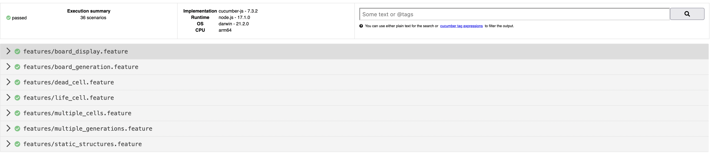

# GameOfLife-BDD

## Rules of life

Based on Wikipedia: Conway's Game of Life: [Rules](http://en.wikipedia.org/wiki/Conway%27s_Game_of_Life#Rules)

The universe of the Game of Life is an infinite two-dimensional orthogonal grid of square _cells_, each of which is in one of two possible states, _alive_ or _dead_. Every cell interacts with its eight _neighbors_, which are the cells that are horizontally, vertically, or diagonally adjacent. At each step in time, the following transitions occur:

### 1. Under-Population

-   Any live cell with _fewer than 2_ live neighbors _dies_

### 2. Next Generation

-   Any live cell with _2 or 3_ live neighbors _lives_ on

### 3. Overcrowding

-   Any live cell with _more than 3_ live neighbors _dies_

### 4. Reproduction

-   Any dead cell with _exactly 3_ live neighbors becomes a _live_ cell

The first generation is created randomly or with a predefined pattern.

By applying the above rules simultaneously to every cell in the seed—births and deaths occur simultaneously, and the discrete moment at which this happens is sometimes called a _tick_. The rules continue to be applied repeatedly to create further generations.

## How to run

## How to run Swann

C'est un projet typescript, il y a donc une étape de build.

Lors du developpement cette étape de build et lancé a chaque modification avec :

```zsh
npm run dev
```

Pour transipiler l'application typescript en application javascript on peut faire :

```zsh
npm run build
```

Et pour lancé l'application en production :

```zsh
npm run start
```

Pour lancé les tests avec le coverage on utilise la command

```zsh
npm test
```

### Paramètre additionnel

Il est possible de rajouter des paramètre additionnels pour la hauteur et la largeur du board. Les paramètres sont totalement optionnels.

Voici un exemple de code qui modifiera ces valeurs

```zsh
yarn start height=14 width=12
```

## Classes

## Tests & Coverage

Nos tests sont fait avec cucumber on a 36 scenarios et 110 steps

On couvre 100% de la logique du jeu


Et voici le report cucumber

